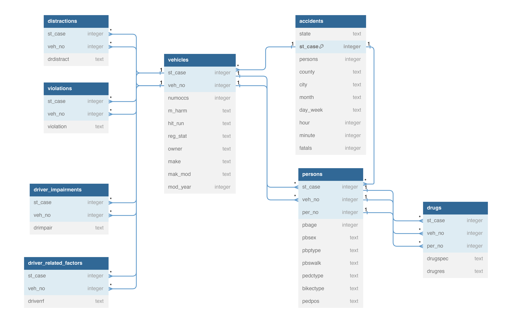

# **Reducing Traffic Mortality in the USA**

Note that the data used for this report is from the year 2022

By **Mike Musas**    |    *August 10, 2024*

## **Project Dashboard**

Link to project dashboard: [MSBA Capstone Project Dashboard](https://public.tableau.com/views/msba_project_dashboard/Demographic?:language=en-US&:sid=&:redirect=auth&:display_count=n&:origin=viz_share_link)

## **1. Introduction**

Traffic mortality has been a public health issue in the United States, with thousands of individuals dying each year due to various factors contributing to road accidents. This project aims to identify the leading causes of traffic fatalities and recommend effective strategies to reduce the number of deaths on American roads.

The project will examine the leading contributors to traffic fatalities, including speeding, drunk driving, and distracted driving. Speeding remains one of the most significant factors, as higher speeds reduce the driver’s ability to react to sudden changes and increase the severity of accidents. Drunk driving is another major cause, with impaired judgment and delayed reaction times leading to a higher likelihood of crashes. Distracted driving, often due to mobile phone use or other in-vehicle distractions, has also emerged as a critical concern in recent years.

**The project also aims to answer the following questions:**

* How has the total number of traffic fatalities changed over the past years?
* What are the age and gender distributions of traffic mortality victims?
* How does traffic mortality vary by state or region?
* Do the number of fatalities correlates with the population of regions?
* How does the fatality rate varies between rural and urban areas?
* What are the leading causes of traffic fatalities in the USA in 2022?

To answer all these questions, we are making use of Tableau desktop (for data visualization and also to create our report) and Bigquery (to create our database and store all the tables we are using).

## **2. About the Data**

### **2.a Database and Source**

The data used to answer the project’s questions come from the [National Highway Traffic Safety Administration](https://www.nhtsa.gov/file-downloads?p=nhtsa/downloads/FARS/) or NHTSA website. The data is comprised of 33 tables. However, 8 tables were used to answer our questions. Before doing our analysis, the data had to go through a cleaning process where the necessary number of columns were selected from every table. All the tables in this project were stored in a **MySQL database**.

### **2.b Entity-Relationship Diagram (ERD)**
 
The image below shows the entity-relationship diagram or ERD of the database used in this project. The ERD picture the relationship below all the tables in the database. This helps us understand the structure of the database and also understand how we can link different tables together. Note that the ERD below only shows a couple of columns for some of the tables. The reason behind this is to make sure everything is visible on the image.

.

## **3. Exploratory Data Analysis**

### **3.a There has been an Upward Trend in the total fatalities on the U.S.A. from 2010 to 2022**

Although the number of fatalities slightly decreased (**-1.68%**) in 2022 compared to 2021, the total number of death due to road traffic is huge and needs to be addressed as soon as possible. There were a total of **42,514 individuals who died in 2022**.

.

In 2010, the total number of road fatalities stood at 32,999. This figure remained relatively stable over the next few years, with minor fluctuations observed until 2014. This stability suggests that existing road safety measures during this period were relatively effective in maintaining a consistent number of fatalities.

Starting from 2015, there is a noticeable and steady increase in the number of road fatalities. This upward trend continues, reaching its peak in 2021 with a total of 43,230 fatalities. The increase during this period raises significant concerns about the effectiveness of road safety policies and the potential impact of other factors such as increased vehicle usage, distracted driving, or infrastructure issues.

In 2022, there is a slight decrease in road fatalities to 42,514, down from the peak observed in the previous year. While this reduction is a positive sign, the overall number of fatalities remains high, indicating that further measures are necessary to achieve a more substantial and sustained decrease.

The trend in US road fatalities from 2010 to 2022 highlights both periods of stability and significant increases, culminating in a peak in 2021. Despite a slight reduction in 2022, the overall trend underscores the critical need for comprehensive and proactive approaches to road safety to protect lives and reduce the number of fatalities on US roads.

### **3.b How do traffic fatalities vary by demographic factors such as age, gender, and location?**

#### **Fatalities by Gender**

# **73.25%**
of people who died in a car accident in 2022 in the USA were **males** compared to only 26.75% of females.

#### Fatalities by Urban and Rural

# **59.15%**
of fatalities on US roads happened in **urban** areas compared to 40.85% in rural areas

#### **Fatalities by Age Group**

The distribution of traffic fatalities across different age ranges shows that certain age groups are more vulnerable than others. **The data reveals tha the highest number of fatalities occurs in the age group 24 to 36, followed by 36 to 48 and 48 to 60**. It can also be seen that these are groups are made of young individuals. These age groups should be prioritized for targeted interventions.

Young people are more prompt to be in front of the car wheel compare to other groups. This is also one reason the top three groups are young. We should make sure that our young population is well informed and educated about the risks and consequencies of not following traffic laws. 

The group with the smallest number of fatalities were olders and children. A total of 364 helder people died in 2022 due on the road were 84 years old or older, they are making 0.86% of the total fatalities while children under the age of 12 years old or below made 0.82%. Most individuals tend to drive very careful when there is a child in the car compared to when there is not.

.

#### **Fatalities by State**

Most of the fatalities in the USA are in these three states California, Texas, and Florida. These states make 29.09% of the road fatalities. Their total of fatalities were 4,428, 4,408, and 3,530, which makes the state of California as the leading state.
The District of Columbia showed the lowest number of deaths in the year 2022, with only 32 people who died on the road. The state is followed by the Rhode Island and Vermont states, with 52 and 76 deaths respectively.

.

#### **Fatalities by State vs Population size**

It can also been seen in the graph above that there is a strong correlation between the total population of a state and the total road fatalities. States with high density population tend to experience a lot of road traffic deaths. The leading states are again California, Texas, and Florida. These states have a high population density, having 39, 30, and 22 million people respectively. These three states represent 27.40% of the USA total population.

.

### **3.c Major Causes of Road Traffic Fatalities in the USA in 2022**

#### **Distractions Leading to Fatalities**

Distracted driving is another prevalent issue, with inattention being the leading cause of fatalities, resulting in 1,421 deaths. General distraction, whether from mobile phones, other occupants, or external factors, contributes to an additional 495 fatalities. The data further breaks down the distractions, with mobile phone usage (both manipulation and other phone-related activities) accounting for significant numbers—157 and 139 fatalities respectively. These figures highlight the urgent need to address distracted driving through both technological solutions and behavioral changes. Banning the use of handheld devices while driving, promoting the use of hands-free technology, and educating drivers on the risks of distraction can help mitigate this problem. Additionally, developing and implementing in-vehicle technology to limit distractions and enhance driver focus could further reduce these fatalities.

.

#### **Violations Leading to Fatalities**

Traffic violations are another critical factor leading to road fatalities. The data highlights that manslaughter or homicide due to traffic violations results in 1,555 deaths, while driving while intoxicated, whether due to alcohol or drugs, accounts for 1,369 fatalities. Failure to yield, inattentiveness, and improper driving practices are also major contributors, resulting in 647 and 617 fatalities respectively. These statistics point to a need for better driver education and stricter enforcement of traffic laws. Programs focusing on defensive driving, the dangers of impaired driving, and adherence to traffic regulations could significantly reduce these numbers. Furthermore, implementing advanced traffic monitoring systems and increasing the visibility of law enforcement on the roads can act as deterrents to such violations.

.

#### **Leading Drugs Involved in Accidents**

Drug impairment is a major contributor to road accidents, with certain substances being more prevalent in these incidents. The data reveals that Delta 9-tetrahydrocannabinol (THC), the active component in marijuana, tops the list with 7,204 cases, followed closely by its metabolite, 11-nor-9-carboxy-delta-9-tetrahydrocannabinol (Carboxy THC), at 6,259 cases. Stimulants like amphetamine and methamphetamine are also significant contributors, involved in 5,197 and 5,171 accidents respectively. The presence of various forms of THC and other cannabinoids underscores the impact of marijuana on driving capabilities. Additionally, substances such as caffeine, fentanyl, and cocaine, though less prevalent, still pose substantial risks. Addressing the issue of drug-impaired driving requires a multi-faceted approach, including public awareness campaigns, stricter regulations, and enhanced enforcement measures to detect and deter drug use among drivers.

.

#### **Percentage of Fatalities by Speeding**

Speeding is yet another leading cause of road fatalities, with 30.30% of fatal accidents involving speeding. High speeds reduce the driver's reaction time and increase the severity of crashes. Addressing this issue requires a multifaceted approach. Law enforcement can play a crucial role by strictly monitoring and penalizing speeding violations. Moreover, educating drivers about the dangers of speeding and encouraging safer driving habits through public service announcements and community programs can create a cultural shift towards safer driving behaviors. Advanced technologies, such as speed cameras and intelligent speed adaptation systems in vehicles, can also help in reducing speeding-related fatalities.

.

#### **Percentage of Fatalities by Impairments**

Impairment is another critical factor in road fatalities. The data shows that 38.18% of fatalities involved drivers with impairments, such as alcohol or drug influence. This statistic is alarming and underscores the need for stringent measures to combat impaired driving. Public awareness campaigns, stricter enforcement of DUI laws, and the implementation of sobriety checkpoints can significantly reduce the incidence of impaired driving. Additionally, promoting the use of alternative transportation options, like rideshares and public transport, can help keep impaired individuals off the roads.

.

#### **Fatalities by Trafficway**

The second chart reveals that the type of trafficway plays a crucial role in the incidence of fatalities. Two-way, non-divided roads are the most hazardous, accounting for 24,138 fatalities. In contrast, roads with a divided, unprotected median follow with 8,859 fatalities, while those with a positive median barrier report significantly fewer fatalities, at 5,923. The presence of medians, particularly those that are positive and robust, clearly mitigates the risk of fatal accidents. Therefore, enhancing road infrastructure by installing or upgrading median barriers on major roadways could considerably reduce fatalities.

.

#### **Number of Accidents by Days**

The total number of accidents varies throughout the week, as shown in the first chart. Interestingly, the number of accidents is relatively high at the beginning of the week, peaking on Sundays with 6,041 accidents. This number dips to its lowest on Tuesday with 4,887 accidents, before gradually rising again, reaching a peak of 7,006 accidents on Saturdays. This pattern suggests that weekends, particularly Saturdays, are more prone to accidents, likely due to increased travel and recreational activities. Interventions such as increased law enforcement and public awareness campaigns during weekends could be beneficial.

.

#### **Number of Accidents by Hours**

Fatalities also exhibit a distinct pattern when analyzed by hour of the day. The chart shows that the number of fatalities is lower during the early morning hours but starts increasing significantly from around 3 PM, peaking between 6 PM and 8 PM. This trend aligns with the evening rush hour when traffic density is high, and drivers may be fatigued or rushing home. To counter this, implementing measures such as stricter speed limits, better lighting, and heightened police presence during these critical hours could prove effective in reducing the number of fatalities.

.

## **4. Recommendations & Conclusion**

### **4.a Recommendations**

1. Enhance Law Enforcement and Penalties:

    * Strict Enforcement of Speed Limits: Implement widespread use of speed cameras and increase penalties for speeding violations. Enhanced law enforcement visibility on major roads can serve as a deterrent to speeding.
    * Combat Impaired Driving: Introduce more frequent DUI checkpoints and enforce stricter penalties for impaired driving. Promote the use of alternative transportation options like rideshares and public transport, especially during weekends and holidays.
    * Address Distracted Driving: Enforce laws banning handheld mobile phone use while driving. Implement educational campaigns highlighting the dangers of distracted driving and encourage the use of hands-free devices.

2. Improve Road Infrastructure:

    * Install and Upgrade Median Barriers: Prioritize the installation of positive median barriers on high-risk roads, particularly on two-way, non-divided roads.
    * Enhance Roadway Lighting and Signage: Improve lighting on highways and urban roads, especially during evening and nighttime hours. Ensure that road signage is clear and visible to reduce confusion and enhance driver awareness.

3. Public Education and Awareness Campaigns:

    * Promote Safe Driving Practices: Launch nationwide campaigns to educate drivers on the risks of speeding, impaired driving, and distractions. Use social media, television, and community events to reach a wide audience.
    * Target High-Risk Groups: Focus on younger drivers aged 24 to 36, who are more prone to accidents. Implement educational programs in schools and universities to instill safe driving habits early on.

4. Technological Innovations:

    * Implement Advanced Driver Assistance Systems (ADAS): Encourage the adoption of vehicles equipped with ADAS technologies such as adaptive cruise control, automatic emergency braking, and lane-keeping assist.
    * Develop In-Vehicle Monitoring Systems: Promote the use of technologies that monitor driver behavior and provide real-time feedback to reduce distractions and encourage safer driving.

5. Data-Driven Policy Making:

    * Utilize Data Analytics: Continuously analyze traffic data to identify new trends and emerging risks. Use insights from data analysis to inform policy decisions and tailor interventions to specific regions or demographics.
    * Collaborate with Local Governments: Work with state and local governments to implement targeted interventions based on regional data, such as increased patrols in high-fatality areas and infrastructure improvements in identified hotspots.

### **4.b Conclusion**

Reducing traffic mortality in the USA requires a multifaceted approach that addresses the various contributing factors identified in this project. By enhancing law enforcement, improving road infrastructure, conducting public education campaigns, leveraging technological innovations, and utilizing data-driven policy making, we can make significant strides in decreasing the number of road traffic fatalities. The ultimate goal is to create safer roads for all users, thereby protecting lives and reducing the devastating impact of traffic accidents on families and communities. With coordinated efforts and sustained commitment, we can achieve a substantial and lasting reduction in traffic mortality.

